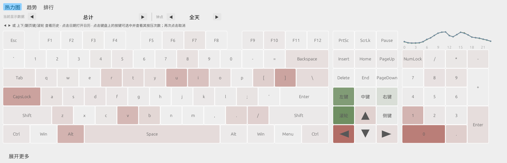
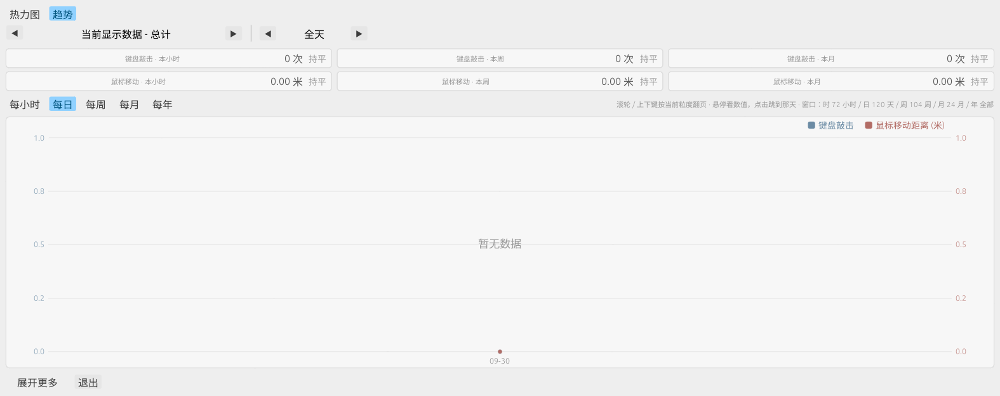
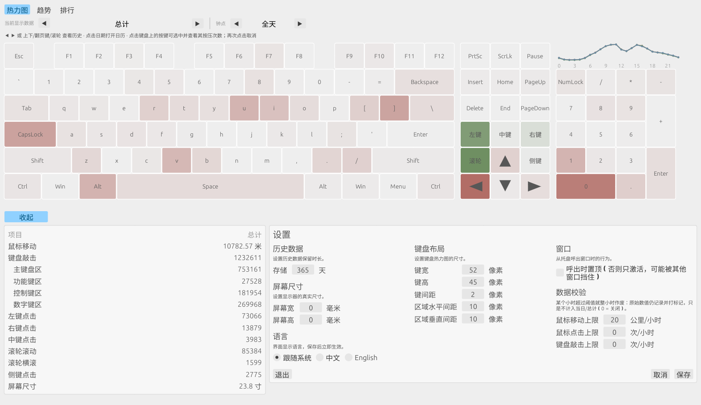
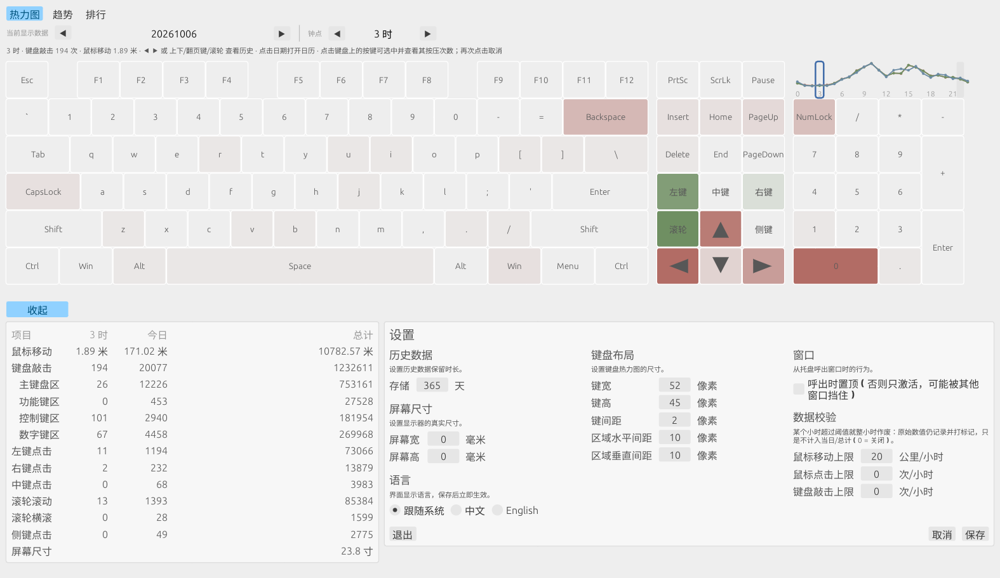
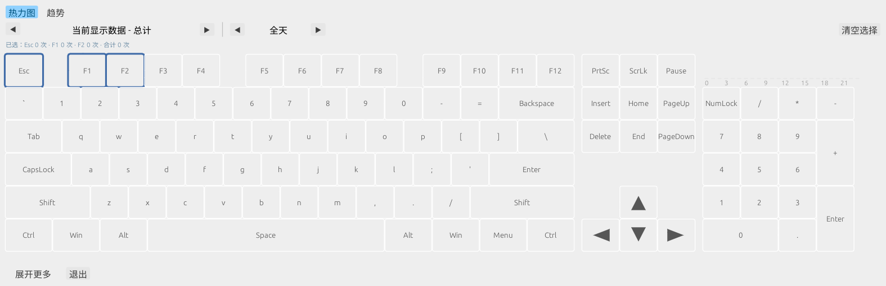
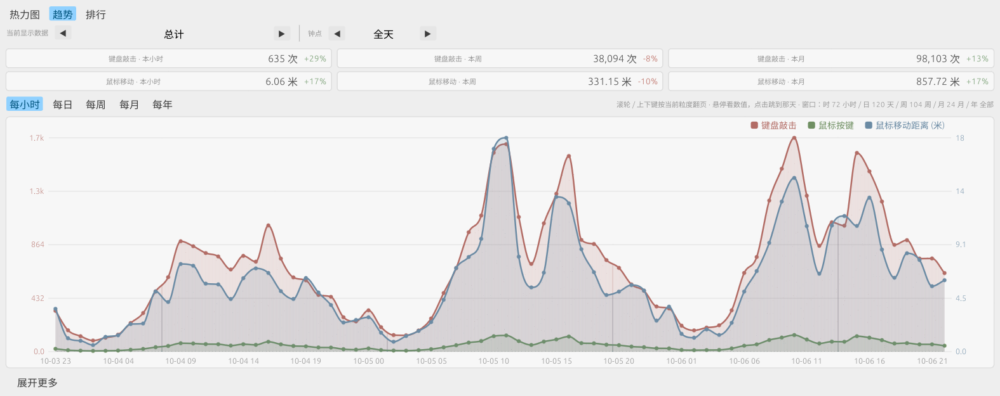
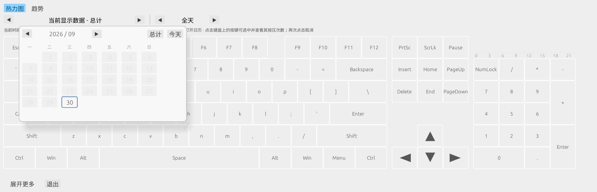
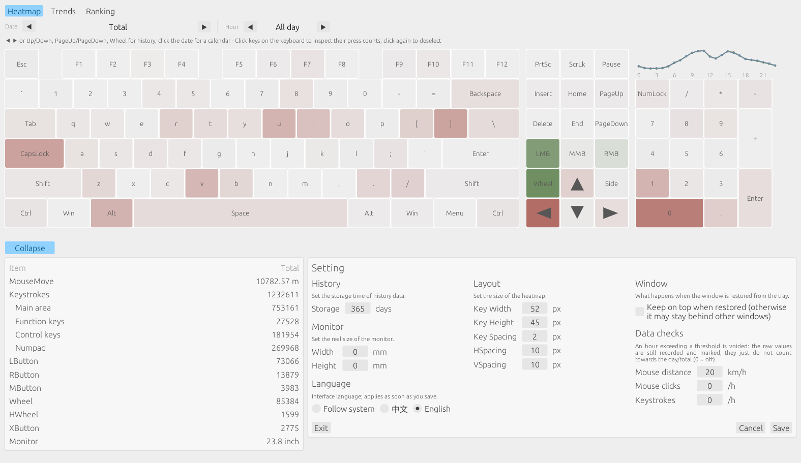

# KMCounter-rs

用 Rust 重建的 [KMCounter](https://github.com/telppa/KMCounter)（原版为 AutoHotkey，仅限 Windows）——使用**键盘热力图**显示鼠标与键盘使用情况的工具。本版本 **Windows 与 Linux（Arch 等）双平台原生支持**，Linux 下 X11 与 Wayland 均可使用。

| 热力图 | 趋势（时/日/周/月/年） |
| --- | --- |
|  |  |

「**展开更多**」固定在窗口底部，点击后统计与设置在下方**左右并排**展开（同一套浅色风格），窗口向下生长、主内容位置始终不变：

| 展开更多（统计 + 设置） | 分时筛选（今日 3 时） |
| --- | --- |
|  |  |

| 点选按键查看计数 | 趋势 · 每小时（最近 72 小时） |
| --- | --- |
|  |  |

点击「当前显示数据 - …」打开**日历**，有数据的日子可直接选（无需逐天翻阅）；设置里的「语言」可切换 **跟随系统 / 中文 / English**，保存后界面与托盘菜单立即切换：

| 日历切换日期 | English 界面 |
| --- | --- |
|  |  |

## 功能

- **键盘热力图**：复刻原版布局（主键区 + 导航区 + 数字键盘区），并补上原版缺的 **PrtSc / ScrLk / Pause** 三个系统键——它们**按控制键区管理**（画在控制键区顶部一行，统计也计入控制键区）；按键越常按颜色越深（莫兰迪渐变 `#EEEEEE → #B26C65`）；鼠标悬停按键显示当日敲击次数
- **统计信息**：鼠标移动（米）、键盘敲击、左/右/中键点击、滚轮滚动、滚轮横滚、侧键点击、屏幕尺寸；其中「键盘敲击」下方按**四个键盘分区**细分——**主键盘区 / 功能键区 / 控制键区 / 数字键区**（只统计布局内的按键，缩进显示为从属项）。默认「今日 / 总计」两列对照，选中某小时后变成「该小时 / 该日 / 总计」三列（查看「总计」时不再重复两列相同的数字）。窗口底部固定「展开更多」按钮，点击后在下方**左右并排**展开统计列表与设置表单（同一套浅色风格），窗口自动向下生长——主内容与按钮位置始终不变，展开面板不遮挡键盘（小键盘也完整可见）
- **分时数据校验**：可给「每小时」设上限——鼠标移动距离（默认 **20 公里/小时**）、鼠标点击总数、键盘敲击总数（后两项默认关闭）。某小时越限即**整小时作废**：原始数值仍记录在案并打上标记，但不再计入当日与总计（界面里该小时的热力不画、24 小时分布条画成灰色、提示行说明「已作废」，悬停可看原始值）。采集出现异常时，这层校验可把失真数据挡在统计之外
- **分时统计（每小时）**：键盘/鼠标/每个按键都按小时单独记录。热力图页的第二个「◀ ▶」可把视图切到任意整点（「全天」⇄ 0–23 时循环），热力图、统计列表、选中按键计数会一起跟着变。键盘右上角那块原本空着的区域（**F12 右侧、小键盘上方**，正好一个键位高）放了一条 **24 小时分布条**：用于查看各小时的使用分布；悬停显示数值，**点击柱子即只看该小时**（再次点击回到全天；深色描边表示当前选中，浅色底表示当前所在小时），不额外占用界面空间
- **趋势图表**：键盘敲击次数与鼠标移动距离两条平滑曲线（双 Y 轴、不同颜色），横轴可切换 **每小时（最近 72 小时）/ 每日/每周/每月/每年**；曲线采用单调三次插值（Fritsch–Carlson），平滑但不会越过数据范围变出负数；悬停查看任意时间桶的具体数值，**左键点击某一点直接跳到那一天**（周/月/年粒度跳到该桶里有数据的那天；每小时粒度连那个小时一起选中）。趋势页与热力图页共用同一条**日期导航行**（当前显示数据、`◀ ▶`、全天/整点）——滚轮 / 上下键 / 翻页键翻日期、点日期标题开日历，两个页面完全一致；**翻页步长跟着粒度走**：周/月/年粒度下滚一格就是一星期/一个月/一年，日与小时粒度仍按天；选定某一天后曲线就切到那一天：每小时粒度看该日 00:00 起的整段（今天则画到当前钟点），每日/每周/每月/每年同样以该日为末端；底部同样提供「展开更多 / 退出」
- **环比卡片**：趋势页顶部按「键盘敲击 / 鼠标移动」两行展示 **本小时/本周/本月** 的数据，分别对比昨日同一小时/上周同期/上月同期（等长窗口，避免与不完整周期对比造成偏差），涨跌用百分比与颜色标注；卡片的对照对象跟着导航行选定的日期走（看历史某天时标题变为「该小时 / 该周 / 该月」）
- **CSV 导出**：`kmcounter --export [路径]` 把每日数据（日期、键盘敲击、鼠标移动像素/米、各键计数、滚轮）导出为 CSV，同目录另存一份 `*_hourly.csv` 分时明细（日期、小时、键盘、鼠标、各键计数），便于用 Excel 或其他工具继续分析
- **点选按键查看计数**：点击热力图上的按键即可选中（可多选，再次点击取消；右上角「清空选择」可一次清空），信息行显示每个选中键的按压次数与合计——计数随当前查看的**日期与小时**变化：选中某小时后只看该小时，查看「总计」时显示记录以来的累计次数
- **常驻系统托盘**：点击窗口关闭按钮收起窗口，后台继续统计。Windows/X11 直接隐藏（任务栏条目消失）；**KDE Wayland** 下程序会自动写入 KWin 窗口规则（跳过任务栏与 Alt-Tab）并最小化窗口，效果同样是「屏幕上没有、任务栏没有、只在托盘」。点击托盘图标（或托盘菜单「统计」、或再次运行程序）即可重新显示窗口——KDE 下由 KWin 脚本取消最小化并激活，**呼出时自动切回「今日」**，并默认**不置顶**（`keep_on_top = false`，窗口正常参与窗口层级；若被其他窗口遮挡，点击窗口或再次点击托盘即可）。需要呼出后始终置顶时可设为 `true`。其他 Wayland 桌面请点任务栏条目，这是系统限制
- **明确的退出方式**：窗口底部「退出」按钮，或托盘菜单「退出」——该路径由独立控制线程处理，窗口最小化/隐藏时同样可靠。`close_to_tray = false` 可让关闭按钮直接退出程序
- **不挡关机/重启/注销**：点击 × 是「收起托盘」，但关机、重启、注销时桌面发送的是同样的关闭请求，一律取消会阻塞桌面流程。程序通过三路信号识别会话结束，任一命中即保存并退出（休眠只保存）：
  1. logind `PrepareForShutdown`（关机/重启）；
  2. logind 会话属性 `State == "closing"`（会话正在终止）；
  3. 用户总线上 `org.kde.LogoutPrompt` 被拉起（Plasma 注销时必然出现）。
  并且窗口关闭回调会读这个标记：确实要注销就直接退出，不再收起托盘；若桌面已经弹出「正在等待 KMCounter-rs 关闭」，若此前那次关闭请求是被本程序取消的，也会立刻保存退出（避免桌面等待）
- **历史数据**：按天（+ 按小时）存储，`◀ ▶` 按钮、上下/翻页键或鼠标滚轮翻看历史与总计（与原版一致，只显示有数据的天）；**点击「当前显示数据 - …」打开日历**，按月份铺开，有数据的日子可点，另附「今天 / 总计」快捷键（历史较长时无需逐天翻阅）
- **设置**：历史保留天数、显示器物理尺寸、热力图键宽/键高/间距、**界面语言（跟随系统 / 中文 / English）**、窗口行为与**分时阈值**，保存立即生效（与统计列表同一套浅色风格，左右并排展开；设置表单按「历史数据 + 屏幕尺寸 / 键盘布局 / 语言 + 窗口 + 数据校验」**分三栏**排列，展开后高度更紧凑）；切换语言会同时更新窗口标题与托盘菜单，没有中文字体时中文自动回退英文并给出提示
- **托盘常驻**：统计 / 设置 / 开机启动 / 退出；点击托盘图标打开统计窗口
- **只统计物理输入**：Windows 忽略注入输入（LLKHF_INJECTED），Linux 跳过 uinput 虚拟设备（与原版"区分真实模拟"一致）
- **开机启动**：Windows 写注册表 Run 键，Linux 写 `~/.config/autostart/*.desktop`
- **中英双语**：跟随系统语言，也可在设置里随时切换（或写进配置固定）
- **不向系统其他位置写文件**：只有配置与统计两个文件，删除即完成卸载

## 构建与安装

### Arch Linux

```bash
# 构建依赖：base-devel（系统一般自带）；运行依赖常见桌面已自带
cargo build --release
# 产物：target/release/kmcounter
```

**权限**：Linux 读取键盘需要 `input` 组权限：

```bash
sudo usermod -aG input $USER   # 然后重新登录
```

### Windows

```bash
cargo build --release
# 产物：target/release/kmcounter.exe（无需任何运行时依赖）
```

或直接在 GitHub Actions（push 后自动运行）下载构建产物。

在 Linux 上交叉编译 Windows 版（无需 sudo，用 llvm-mingw）：

```bash
# 1) 用户级 rustup + Windows 目标
curl --proto '=https' --tlsv1.2 -sSf https://sh.rustup.rs | sh -s -- -y --profile minimal --no-modify-path
~/.cargo/bin/rustup target add x86_64-pc-windows-gnu

# 2) llvm-mingw 工具链（解压即用），并补上 rustc 需要的 libgcc/libgcc_eh
mkdir -p ~/opt && cd ~/opt
curl -LO https://github.com/mstorsjo/llvm-mingw/releases/download/20260922/llvm-mingw-20260922-ucrt-ubuntu-22.04-x86_64.tar.xz
tar -xf llvm-mingw-*.tar.xz && rm llvm-mingw-*.tar.xz && ln -sfn llvm-mingw-2026* llvm-mingw
mkdir -p ~/opt/mingw-compat && cd ~/opt/mingw-compat
ln -sf ~/opt/llvm-mingw/lib/clang/*/lib/windows/libclang_rt.builtins-x86_64.a libgcc.a
ln -sf ~/opt/llvm-mingw/x86_64-w64-mingw32/lib/libunwind.a libgcc_eh.a

# 3) 编译（产物 target/x86_64-pc-windows-gnu/release/kmcounter.exe）
cd /path/to/kmcounter
TC=~/.rustup/toolchains/stable-x86_64-unknown-linux-gnu
PATH="$HOME/opt/llvm-mingw/bin:$PATH" RUSTC="$TC/bin/rustc" RUSTFLAGS="-L $HOME/opt/mingw-compat" \
  "$TC/bin/cargo" build --release --target x86_64-pc-windows-gnu
```

产物只依赖 Windows 自带的系统 DLL（`kernel32`/`user32`/`gdi32`/`opengl32`…），不需要 VC++ 运行库。
在 Windows 本机上按同一路线构建时另有两个坑（已在真机验证）：① cargo 若继承了 `127.0.0.1` 的代理会连不上 crates.io，用 `cargo --config "http.proxy=''" fetch` 或把 `HTTPS_PROXY` 指到真实代理；② 主机工具链要用 **gnullvm/gnu**（自带或配合 llvm-mingw 的链接器），用默认的 MSVC 主机工具链编 GNU 目标会因为缺 `link.exe`（没装 VS）直接失败；
Cargo 特性开关：Linux 侧 `cargo build --features softshot` 可在无 GPU 环境离屏出图（见文末调试辅助）。

### 运行

```bash
kmcounter          # 常驻运行（托盘 + 统计窗口）
```

## 命令行

```text
kmcounter --stats        终端查看今日/总计统计、今日分时与最常用按键
kmcounter --export [路径]  导出每日数据 CSV（默认 ./kmcounter_export_日期.csv）
                             分时明细另存为 *_hourly.csv
kmcounter --import INI   导入原版 KMCounter 的 KMCounter.ini（UTF-16/UTF-8 均可）
                            按键按扫描码对应，鼠标距离按本机屏幕换算回像素；
                            已存在的日期不会覆盖，原版 [total] 与逐日数据不一致时不采用
kmcounter --reset        重置数据（1=仅今日 2=清空全部）
kmcounter --config PATH  指定配置文件路径（stats.json 存放在同目录）
kmcounter --version      显示版本
kmcounter --help         显示帮助
```

从原版迁移：把原版目录里的 `KMCounter.ini` 拷过来，退出正在运行的本程序后执行
`kmcounter --import KMCounter.ini`，即可把按天数据（含每个按键的计数）与鼠标统计导入
`stats.json`；原版的 `[history] storage`（保留天数）大于当前设置时会自动同步，避免旧数据被清理。

## 数据与配置

### 原版数据里的“几百公里”鼠标距离

原版的鼠标距离累加有个 bug（光标被程序强行挪动、或它每 10 分钟重载钩子时“上一次坐标”过期，
会把整屏跨度当成一次真实位移累加），少数日子会记成 200~500 km，而正常日子只有 0.4~1.4 km，
这些尖峰会把总计与趋势图彻底带偏。用 `tools/fix_move_outliers.py` 只清这几项：

```bash
python3 tools/fix_move_outliers.py stats.json --dry-run   # 先看要改哪些天
python3 tools/fix_move_outliers.py stats.json             # 实际写入（自动备份为 .bak）
```

它只把超阈值那几天的「鼠标移动距离」置 0（键盘敲击、每个按键计数、鼠标按键/滚轮全都不动），
总计里的鼠标距离同步扣减，写回时保持程序用的紧凑格式（`keys` 数组单行）。


数据默认就放在**程序所在目录**（`config.toml` 与 `stats.json`，和原版 KMCounter 一样是绿色便携式）：程序、配置、统计三者在一起，拷到哪台机器/哪块盘都能直接用；双系统共用同一块盘时，两个系统各放一份可执行文件、共用同一份数据即可。

| 情况 | 位置 |
| --- | --- |
| 默认（程序目录可写） | 可执行文件同级目录：`config.toml`、`stats.json` |
| 程序旁有 `datadir.txt` | 取该文件里写的目录（一行路径，支持 `~/`，`#` 注释）——适合「程序放系统盘、数据放移动盘/双系统共享盘」 |
| `--config PATH` | 以指定路径为准（`stats.json` 放在同目录） |
| 程序目录不可写（如装到 `/usr/bin`、`Program Files`） | 自动回退：Linux `~/.config/kmcounter/`，Windows `%APPDATA%\kmcounter\` |

首次切到程序目录时会**自动迁移**旧位置的数据（迁移动作写进日志；老版本升级无缝衔接）。用 `datadir.txt` 指定了目录时不做迁移，原位置的数据原样保留。

例如把程序放在系统盘、数据放共享盘（双系统各放一份可执行文件、共用同一个数据目录）：

```text
/tmp/kmc/datadir.txt        →  一行：/mnt/item/项目/run/KMCounter
/tmp/kmc/kmcounter          # Linux 程序
D:\KMCounter\datadir.txt     →  一行：E:\项目\run\KMCounter
D:\KMCounter\kmcounter.exe   # Windows 程序
```

注意程序目录里的数据会随 `cargo clean` 之类操作一起消失，长期使用建议放到固定文件夹（例如 `D:\KMCounter\`）。

`stats.json` 是「总计 + 按天 + 按小时」三层结构：每天一条汇总，外加**只在实际有输入的小时**建立的分时明细。按键计数写成单行数组（101 个数字铺成 101 行会让文件大十倍），实测一年约 **3–5 MB**（每天 8–13 KiB，视活跃小时数而定），超过 `history_days` 的旧数据（连同其分时明细）会自动删除，所以体积会稳定在这个量级不再增长。

`config.toml`（首次运行自动生成，全部可省略）：

```toml
language = "auto"      # auto | zh | en
history_days = 365     # 历史数据保留天数（上限 10000）
close_to_tray = true   # 点窗口关闭按钮：true=收起窗口继续统计，false=直接退出
skip_taskbar = true    # (Linux/KDE) 自动写入 KWin 规则：不在任务栏/Alt-Tab 显示，只留托盘
keep_on_top = false    # (Linux/KDE) 从托盘呼出时是否置顶；false 时靠激活置前，可能被其他窗口挡住
screen_w_mm = 0        # 显示器物理宽度（毫米），0 = 自动检测
screen_h_mm = 0        # 显示器物理高度（毫米），0 = 自动检测
screen_px_w = 0        # 主显示器像素宽度，0 = 自动（Linux 从 DRM 首选分辨率读，Windows 用 GetSystemMetrics）
limit_move_km = 20     # 某小时鼠标移动超过该值（公里）则该小时作废（原始值仍记录，只是不计入当日/总计；0 = 关闭）
limit_clicks = 0       # 某小时鼠标点击总数（左+右+中+侧）超过该值则作废（0 = 关闭）
limit_keystrokes = 0   # 某小时键盘敲击总数超过该值则作废（0 = 关闭）
font_path = ""         # 中文字体文件路径，留空自动查找
autostart = false      # 开机启动（托盘菜单管理）

[layout]
key_w = 52             # 键宽（像素）
key_h = 45             # 键高（像素）
key_spacing = 2        # 键间距（像素）
h_spacing = 10         # 区域水平间距（像素）
v_spacing = 10         # 区域垂直间距（像素）
```

## 调试辅助

> 提示：如果用**另一个目录**里的副本（默认配置 `skip_taskbar = false`）做测试，它会顺带把 KDE 的 KWin「跳过任务栏」规则删掉 —— 正式运行的那份配置里是 `true`，再启动一次正式副本即可恢复；测试副本请把它自己的 `skip_taskbar` 也设为 `true` 以免互相影响。

以下环境变量用于界面调试与自动化截图（普通使用无需关心）：

```bash
# 启动时展开底部面板 / 指定起始页 / 启动后收起（可逗号组合）：
#   stats | settings | both  → 展开底部面板；trend → 起始页为趋势；min → 启动后收起
KMCOUNTER_START_PANELS=stats,trend kmcounter

# 启动后自动连拍 3 张窗口截图（PPM 格式，可用 ImageMagick 转 PNG）
KMCOUNTER_SCREENSHOT=/tmp/shot kmcounter   # 生成 /tmp/shot-1.ppm 等

# N 秒后模拟托盘“退出”命令（验证退出与保存路径）
KMCOUNTER_AUTO_EXIT_SECS=10 kmcounter

# N 秒后模拟“系统关机”（验证关机前保存并主动退出）
KMCOUNTER_FAKE_SHUTDOWN_AFTER_SECS=10 kmcounter

# N 秒后模拟“桌面开始注销”（不真的注销；配合 KMCOUNTER_FAKE_CLOSE_AFTER_SECS 可验证
# 「注销时的关闭请求应直接退出而不是收起托盘」）
KMCOUNTER_FAKE_LOGOUT_AFTER_SECS=5 KMCOUNTER_FAKE_CLOSE_AFTER_SECS=10 kmcounter

# N 秒后模拟“点击窗口关闭按钮”（可逗号分隔多次，验证收起/呼出循环）
KMCOUNTER_FAKE_CLOSE_AFTER_SECS=8,24 kmcounter

# N 秒后自动切到另一个页面 / 打印布局锚点数值（排查布局位移）
KMCOUNTER_SWITCH_PAGE_AFTER_SECS=6 KMCOUNTER_LAYOUT_LOG=1 kmcounter

# 打开即选中某小时 / 某个历史视图（0=总计 1=今日 2=昨天…）、趋势页初始粒度
KMCOUNTER_HOUR=9 KMCOUNTER_VIEW_IDX=1 KMCOUNTER_GRAN=hour kmcounter

# 打印各容器（卡片/图表/两块面板）的矩形，排查对齐问题
KMCOUNTER_GEO_LOG=1 kmcounter
```

没有可用 GPU 的机器（CI、纯远程）可以用软件光栅化直接出图——不依赖窗口系统与 OpenGL：

```bash
python3 tools/demo_stats.py /tmp/demo            # 生成 76 天演示数据（不含任何真实数据）
KMCOUNTER_SHOT_STATS=/tmp/demo/stats.json KMCOUNTER_SHOT_DIR=/tmp/shots \
  cargo test --release --features softshot -- --ignored --nocapture render_readme_shots
# KMCOUNTER_SHOT_W 可指定窗口宽度（默认 1260），会输出 8 张 PPM（heatmap/expand/hour/…/trend）
```

## 平台说明

### Linux

- 输入捕获使用 **evdev**（`/dev/input/event*`），在 X11 与 Wayland 下都能全局统计，并支持设备热插拔
- 托盘使用 **StatusNotifierItem**（DBus）：KDE、Cinnamon、XFCE、Hyprland+waybar 等开箱即用；GNOME 需要安装 AppIndicator 支持扩展。托盘不可用时程序自动退化为普通窗口模式（关闭窗口即退出）
- **Wayland 的窗口限制**（winit 平台限制，非本程序可绕过）：程序无法隐藏窗口，点关闭按钮改为最小化。在 **KDE** 上程序会配合自动写入的 KWin 规则（`skip_taskbar = true`）实现「只在托盘」：窗口不进任务栏、不进 Alt-Tab，托盘点击/二次启动时用 KWin 脚本自动恢复窗口。非 KDE 的 Wayland 桌面没有可用的「跳过任务栏」协议，窗口会留在任务栏，恢复请点任务栏条目
- 规则写入 `~/.config/kwinrulesrc`（首次修改前备份为 `.bak`，只增删带 `KMCounter-rs (auto)` 标记的规则，不影响你的其他规则）；关闭 `skip_taskbar` 即自动移除
- 显示器物理尺寸从 DRM 的 EDID 自动读取，无法读取时可在设置中手动指定
- 统计界面基于 OpenGL（eframe/glow）

### Windows

- 输入捕获使用 **WH_KEYBOARD_LL / WH_MOUSE_LL** 低级钩子，逻辑与原版逐条对应（抬起计次、忽略注入输入、滚轮每条消息计 1）
- 托盘为原生 `Shell_NotifyIconW` 实现（`NOTIFYICON_VERSION_3`）：左键点击打开统计窗口，右键弹菜单；
  处理了 Explorer 重启广播（`TaskbarCreated`）——否则任务栏重启后图标会残留但点击无响应
- 点 × 收起窗口后，从托盘呼出**不依赖渲染循环**：直接 `ShowWindow`/`SetForegroundWindow`（隐藏窗口在 Windows 上收不到重绘，egui 的 Viewport 命令可能无人处理）。主窗口按确定特征识别（winit 窗口类 `Window Class` 或标题前缀 `KMCounter-rs`），并跳过 OpenGL 驱动的像素格式假窗口（`NVOpenGLPbuffer`）、winit 消息窗口、输入法窗口；句柄使用后自检，识别错误时丢弃并重新查找——否则会出现日志显示成功、窗口却未出现的情况
- 托盘左键同时接受 `WM_LBUTTONUP` 与 `NIN_SELECT`/`NIN_KEYSELECT`（键盘或部分系统位置只发后者）
- 从终端启动时保留控制台（`GetConsoleProcessList` 判断），双击/自启才隐藏黑窗口，便于 `RUST_LOG=kmcounter=debug` 排查

## 与原版的主要差异

| 项目 | 原版 (AHK) | 本版本 |
| --- | --- | --- |
| 平台 | Windows | Windows + Linux |
| 数据存储 | `KMCounter.ini`（按天 INI 节） | `stats.json`（按天 JSON） |
| 键盘布局 | 无 PrtSc / ScrLk / Pause 三个键 | 补齐这三个键（历史统计里记在“布局外”的计数会在启动时自动迁回） |
| 统计窗口列 | 今日/本周/本月/总计（仅今日与总计有数据） | 今日/总计 + 键盘四分区细分 |
| 跨夜处理 | 重启进程 | 进程内自动滚动，无需重启 |
| 键盘布局定制 | 修改代码 LoadControlList | 配置文件 `[layout]` 尺寸（行列结构内置） |
| 每日数据不足 100 键时 | 弹窗提示 | 界面内常驻提示 |
| 钩子每 10 分钟重载 | 有（对抗 AHK 按键映射） | 无（Linux 不需要；Windows 钩子次序问题在实践中少见） |
| `--stats` / `--reset` | 无 | 有（终端查看与重置） |
| 趋势图表（时/日/周/月/年曲线） | 无 | 有（趋势页，双 Y 轴平滑曲线 + 每小时粒度） |
| 分时统计 | 无 | 有（按小时明细：整点筛选、24 小时分布条、本小时环比、`--stats` 分时、`--export` 分时 CSV） |
| 环比汇总 / CSV 导出 | 无 | 有（等长窗口对比 + `--export`） |
| 关闭按钮 | 隐藏到托盘（Windows） | 隐藏到托盘（Win/X11）；KDE Wayland 下配合 KWin 规则实现同样的「只在托盘」 |

## 附：Windows 侧排查工具

`tools/windows/` 下是从 Windows 真机排查「托盘呼出失败」时留下的脚本与结论（PowerShell，需在 Windows 上跑）：

| 文件 | 用途 |
| --- | --- |
| `WINDOWS-NOTES.md` | 该问题的完整排查报告（复现步骤、根因、改动、真机验证结果） |
| `winscan.ps1` | 列出某进程所有顶层窗口（类名/标题/可见性/矩形），确认主窗口是哪一只 |
| `probe.ps1` | 向窗口发 `WM_APP_TRAY`（模拟托盘左键）或 `WM_CLOSE`（模拟点 ×） |
| `trayrect.ps1` | 用 `Shell_NotifyIconGetRect` 问 shell 要托盘图标位置 |
| `realmouse.ps1` | DPI 感知的真实鼠标移动/点击 |
| `cycle.ps1` | 自动跑 N 轮「点 × → 托盘呼出」并打印主窗口可见性 |
| `simfind.ps1` | 复现主窗口识别逻辑（与程序内判据一致） |

## 许可

本项目以 **GPL-3.0** 授权（见 [`LICENSE`](LICENSE)，`Cargo.toml` 中同样声明为 `GPL-3.0`）。

## 致谢

- 原版 [KMCounter](https://github.com/telppa/KMCounter) by telppa（本项目为其行为在 Rust 上的重建实现，配色与交互均参照原版）
- 原版热力图思路源自 [fwt](https://www.autoahk.com/archives/35133)
